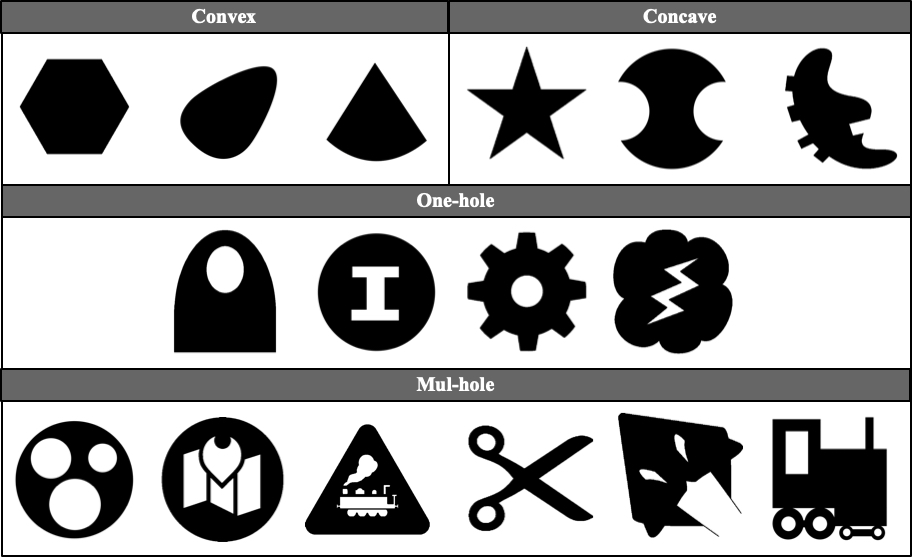
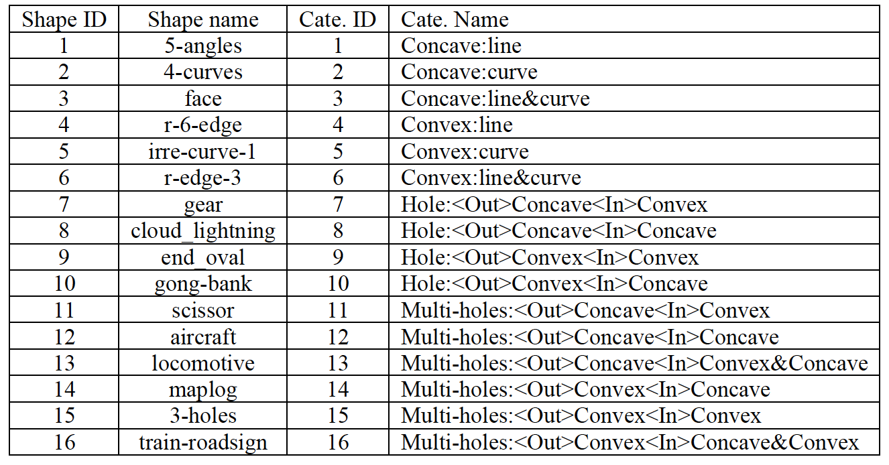
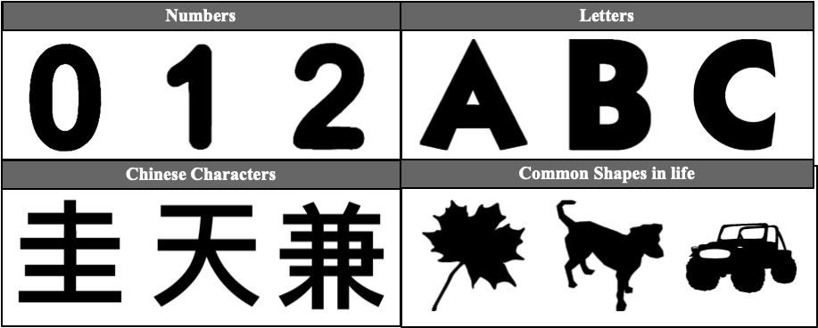

# Self-Assembly-Shape-Set
  This is a public shape set for research in shape formation and self-assembly.
  
  The shape set contains 156 1-connected shapes. In the shape set, we include four categories of shapes: the convex filling shapes (20 shapes), the concave fill shapes (67 shapes), shapes with one hole (33 shapes), and shapes with multiple holes (36 shapes). And according to the property of a shape, we further divide shapes in convex, concave, one-hole, and mul-hole categories into 3, 3, 4, and 6 sub-categories respectively.
  
  The shapes in the convex and concave categories are both divided into shapes enclosed by line segments, shapes enclosed by curves, and shapes enclosed by both line segments and curves. This kind of classification can help researchers to make clear whether the smoothness of the shape edge affects the performance of an self-assembly algorithm.
  
  The shapes in the one-hole and mul-hole categories are divided based on the concave-convex quality of the outer shape and the inner holes' shapes. For shapes in the one-hole group, there are  four composites: (convex, convex), (convex, concave), (concave, convex), and (concave, concave). For shapes in the mul-hole group, there are six composites: (convex, mul-convex), (convex, mulconcave), (convex, mul-convex & mul-concave), (concave, mul-convex), (concave, mul-concave), and (concave, mul-convex & mul-concave). 
  
  In the shape set, each shape is represented as a 512×512 figure with only black and white pixels. Each black pixel in the figure corresponds to a target grid, while the white pixel corresponds to an un-target grid. In Figure.1, we represent a subset of our shape set which contains one shape from each sub-category. The Table.1 shows the name and ID of all 16 categories and one representative shape in each category.
  
  ### Figure.1
  
  
  ### Table.1
  
  
  The shape set also covers some common shapes, including numbers, letters, Chinese characters, and several object silhouettes appearing in our daily life, as shown in Figure.2.
  
  ### Figure.2
  
